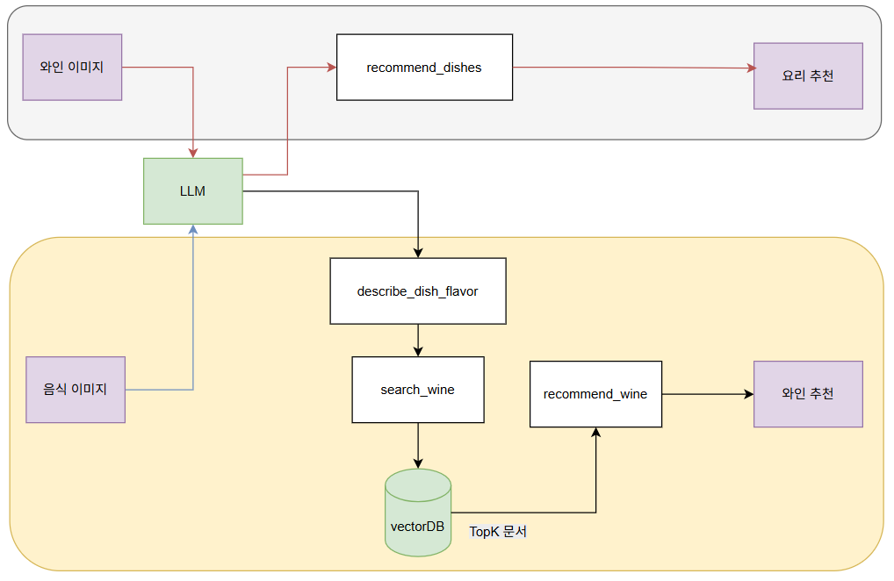

# RAG를 활용한 LLM 서비스 프로젝트 (1)

추가자료: https://www.notion.so/26a73fc3dccb81c8ba8ac2567a77ab1c?pvs=21, https://www.notion.so/26a73fc3dccb8112af70e89d1c157511?pvs=21, https://www.notion.so/26a73fc3dccb81b4886de7e4e6c424b7?pvs=21, https://www.notion.so/26a73fc3dccb81098dbef10e835c54ea?pvs=21
생성 일시: 2025년 9월 10일 오후 3:58

# AI 소믈리에란.

AI 소믈리에는 image → model → text 구조로 작동합니다. 와인이나 요리 이미지를 입력하면 모델이 이를 분석하여 텍스트 설명을 생성합니다.

이 서비스는 와인 및 음식 관련 이미지를 분석하여 다양한 정보를 제공합니다. 예를 들어, 와인 라벨을 분석하여 와인의 특성과 어울리는 음식을 추천하거나, 요리 사진을 분석하여 그 요리와 잘 어울리는 와인을 제안할 수 있습니다.

- food vs. dish
    - dish 를 위한 와인
    - 와인과 어울리는 dish
    - dish의 flavors 에 따른 와인을 찾는 방법

- LLM vs. LMM
    
    chatgpt 4o : omni model은 멀티 모달 → LLM이고 LMM 이다.
    
    LLM : text → model → text
    
    LMM : image → model → text
    



](image%201.png)

[https://app.diagrams.net/#G1r_6GKIV4NGC7_x1pY_VCe3ZOSHGf_v_4#{"pageId"%3A"2TlMpYjinY2yIPdHC9IB"}](https://app.diagrams.net/#G1r_6GKIV4NGC7_x1pY_VCe3ZOSHGf_v_4#%7B%22pageId%22%3A%222TlMpYjinY2yIPdHC9IB%22%7D)

# AI 소믈리에 프롬프팅

1. 프롬프트 설계 
    1. 난이도가 가장 높다 → gpt 를 이용해서 프로토타입 작업을 한다.
    2. 와인 소믈리에에 대하 기본 지식을 습득한다. 
    
    # 와인 소믈리에 리서치(프롬프팅)
    
    - 와인 소믈리에가 하는 일을 설명해
        
        와인 소믈리에는 레스토랑이나 호텔 같은 서비스업장에서 와인과 관련된 모든 일을 담당하는 전문가입니다. 그들이 하는 일은 크게 다음과 같은 역할로 나눌 수 있습니다:
        
        1. **와인 선정 및 관리**
            
            소믈리에는 다양한 와인을 구입하고 와인 리스트를 작성하며, 이를 통해 손님에게 다양한 선택지를 제공합니다. 또한 와인의 품질을 유지하기 위해 와인 저장 환경을 관리하고, 필요한 경우 와인을 추천하여 메뉴에 맞는 완벽한 페어링을 제공합니다.
            
        2. **와인 추천 및 페어링**
            
            소믈리에는 손님의 취향과 요리에 맞는 와인을 추천하는 데 중요한 역할을 합니다. 다양한 음식과 와인의 특징을 잘 이해하고 있어, 요리의 풍미를 더욱 높이는 최적의 와인 페어링을 제안합니다.
            
        3. **와인 서비스 제공**
            
            소믈리에는 와인을 올바르게 서빙하고, 와인 병을 열어 시음할 때 발생할 수 있는 결함을 확인합니다. 또한 와인을 적절한 온도로 준비하여 손님이 최상의 상태에서 즐길 수 있도록 돕습니다.
            
        4. **교육 및 훈련**
            
            소믈리에는 와인에 대해 더 깊은 지식을 쌓고 이를 동료 직원들에게 공유하거나, 고객에게 와인에 대한 지식을 전달하기도 합니다. 고객이 와인에 대해 잘 알지 못할 때는 간단히 설명하며 와인에 대한 이해를 돕습니다.
            
        5. **와인 이벤트 기획**
            
            와인 테이스팅 행사나 와인 디너 이벤트를 기획하고 진행하여 고객이 새로운 와인을 경험할 기회를 제공하기도 합니다. 이를 통해 와인에 대한 지식을 확산시키고, 고객과의 소통을 늘려 브랜드 가치를 높이기도 합니다.
            
        
        와인 소믈리에는 뛰어난 감각과 전문 지식뿐만 아니라 고객 서비스 능력도 필수적입니다. 그들의 역할은 단순히 와인을 제공하는 것을 넘어, 고객에게 잊지 못할 와인 경험을 제공하는 것입니다.
        
    
    - 와인 소믈리에가 되기 위해 필요한 과정을 자세히 알려줘
        
        와인 소믈리에가 되기 위해 필요한 과정은 교육과 훈련, 자격증 획득, 경험 축적 등으로 구성됩니다. 소믈리에는 전문적인 지식과 감각이 필요한 직업이기 때문에 체계적인 준비가 요구됩니다. 다음은 소믈리에가 되기 위한 단계별 과정입니다:
        
        ### 1. 기본적인 와인 지식 습득
        
        - **와인 기초 공부:** 와인의 종류, 포도 품종, 생산 지역, 와인 제조 과정, 테이스팅 방법 등 와인의 기본적인 지식을 익히는 것이 중요합니다.
        - **독학 및 책 학습:** 와인에 대한 전반적인 이해를 돕는 책이나 강의를 통해 기초 지식을 쌓을 수 있습니다. 추천 서적에는 *The World Atlas of Wine*이나 *Wine Folly* 같은 입문서가 있습니다.
        
        ### 2. 와인 교육 과정 및 학위 프로그램 수강
        
        - **와인 학교 및 학원**: 와인에 대한 기초부터 고급 지식까지 배울 수 있는 프로그램을 제공하는 교육 기관에서 전문 지식을 배울 수 있습니다. 국내에도 다양한 와인 학원들이 있으며, 실습과 이론을 병행해 와인 전반에 대한 깊이 있는 교육을 받을 수 있습니다.
        - **호텔 또는 요리 학교의 와인 과정**: 호텔 또는 요리 전문 학교에서도 와인 교육 과정을 제공하는 곳이 많습니다. 와인과 음식 페어링, 테이블 매너, 고객 서비스 등 소믈리에 역할에 필요한 종합적인 교육을 받을 수 있습니다.
        
        ### 3. 자격증 획득
        
        자격증은 소믈리에로서의 전문성을 인정받는 중요한 요소입니다. 대표적인 자격증은 다음과 같습니다:
        
        - **Court of Master Sommeliers (CMS)**: 세계적으로 가장 권위 있는 소믈리에 자격증 중 하나로, Introductory, Certified, Advanced, 그리고 Master Sommeliers라는 네 단계로 구성됩니다. Master Sommeliers는 전 세계적으로 소수만 취득할 정도로 매우 어려운 자격증입니다.
        - **WSET (Wine & Spirit Education Trust)**: 와인과 증류주 관련 교육을 제공하는 국제 교육 기관으로, 레벨 1에서 레벨 4 (Diploma)까지 단계별 과정이 있습니다. WSET Diploma는 Master of Wine(MW) 과정의 필수 자격 요건이기도 합니다.
        - **Sommeliers Korea**: 국내에서 취득할 수 있는 자격증으로, 국내 와인 산업에 맞춘 교육 과정을 제공합니다.
        - **Certified Specialist of Wine (CSW)**: 와인과 관련된 기초 지식부터 고급 지식까지 다루며, 주로 미국에서 인정을 받는 자격증입니다.
        
        ### 4. 실습과 경험 축적
        
        - **레스토랑 및 호텔 근무**: 실제 레스토랑이나 호텔에서 일하면서 손님에게 와인을 추천하고 페어링을 제공하는 경험을 쌓는 것이 중요합니다. 실무를 통해 와인 서비스 능력과 고객 응대 능력을 발전시킬 수 있습니다.
        - **와이너리 방문 및 테이스팅 경험**: 전 세계 다양한 와이너리를 방문하여 와인의 생산 과정을 직접 보고, 다양한 와인을 테이스팅하며 경험을 확장하는 것도 매우 유익합니다.
        - **와인 이벤트 및 테이스팅 참여**: 와인 박람회나 테이스팅 이벤트에 참여해 다양한 와인을 접하고 네트워크를 형성하며 전문성을 키워나갈 수 있습니다.
        
        ### 5. 고객 서비스 능력 및 소통 능력 개발
        
        - **고객 서비스 훈련**: 소믈리에는 단순한 와인 지식뿐 아니라 고객의 취향을 파악하고 이를 반영해 최적의 와인을 추천하는 능력이 중요합니다. 고객 서비스와 관련된 교육을 받고, 실무에서 이를 적극적으로 연습합니다.
        - **커뮤니케이션 스킬 향상**: 와인에 대해 깊이 있는 지식을 고객에게 쉽게 전달할 수 있는 소통 능력은 소믈리에의 중요한 자질 중 하나입니다. 고객이 이해하기 쉬운 언어로 설명하는 연습이 필요합니다.
        
        ### 6. 지속적인 학습과 자기 계발
        
        - **신제품 및 트렌드 파악**: 와인 트렌드는 지속적으로 변하므로, 신제품을 맛보고 새로운 와인 트렌드를 공부하는 것이 중요합니다.
        - **네트워크 형성**: 다른 소믈리에, 와인 전문가들과의 교류를 통해 지식을 확장하고 경력을 쌓을 수 있습니다.
        
        이 과정을 통해 소믈리에는 고객에게 최적의 와인 경험을 제공할 수 있는 전문가로 성장하게 됩니다.
        
        ---
        
        **Q1:** Court of Master Sommeliers의 각 단계에서 어떤 내용이 다뤄지는지 구체적으로 알아보려면 어떻게 할까?
        
        **Q2:** 소믈리에로서 경험을 쌓기 위해 초보자가 시작하기 좋은 장소는 어디일까?
        
        **Q3:** WSET 과정에서 레벨 3과 레벨 4의 차이점은 무엇일까?
        
    
    - 최적의 와인 페어링을 하는 최고의 와인 소믈리에는 어떤 역량이 필요해?
        
        최고의 와인 소믈리에가 최적의 와인 페어링을 위해 갖춰야 하는 역량은 와인과 음식의 특성을 완벽히 이해하고, 이를 고객의 취향과 경험에 맞게 조율하는 능력입니다. 이를 위해 필요한 구체적인 역량은 다음과 같습니다:
        
        ### 1. **와인과 음식의 화학적, 감각적 상호작용에 대한 이해**
        
        - **맛의 균형과 조화**: 단맛, 신맛, 쓴맛, 짠맛 등 다양한 맛 요소가 음식과 와인에서 어떤 상호작용을 일으키는지 이해해야 합니다. 예를 들어, 산미가 높은 와인은 기름진 음식의 느끼함을 줄여주는 효과가 있습니다.
        - **질감과 구조**: 와인의 타닌과 바디, 알코올 함량 등 질감 요소가 음식의 질감과 어떻게 어우러지는지 파악하는 능력이 필요합니다. 이로 인해 음식의 풍미와 와인의 특성이 서로 돋보일 수 있습니다.
        
        ### 2. **다양한 음식과 와인 스타일에 대한 폭넓은 지식**
        
        - **음식 재료와 조리법의 이해**: 음식의 주요 재료와 조리 방식이 맛과 향에 미치는 영향을 이해하고, 이를 와인과 조화시킬 수 있는 능력이 필요합니다. 예를 들어, 구운 고기와 탄닌이 풍부한 레드 와인의 페어링이나 해산물과 상쾌한 화이트 와인의 페어링 같은 기본적인 조합을 넘어서는 깊이 있는 지식이 요구됩니다.
        - **와인 생산지와 스타일에 대한 이해**: 와인의 생산지와 스타일이 음식과 페어링에 미치는 영향을 이해하고, 이를 바탕으로 고객에게 맞는 와인을 추천할 수 있어야 합니다. 이 과정에서 각 와인 스타일의 독특한 특성을 빠르게 파악하고 적용하는 것이 중요합니다.
        
        ### 3. **테이스팅 능력과 감각의 예민함**
        
        - **향과 맛 감별 능력**: 음식과 와인의 미세한 향과 맛을 감지할 수 있는 감각이 중요합니다. 이를 통해 와인과 음식이 조화를 이루는 포인트를 찾아낼 수 있습니다.
        - **와인의 결함 식별**: 페어링 과정에서 와인 결함(예: 산화, 코르크 오염 등)을 빠르게 감지하고 대처하는 능력도 필요합니다. 결함이 있는 와인이 음식과의 조화를 망칠 수 있기 때문에, 이를 감지하는 능력은 매우 중요합니다.
        
        ### 4. **고객의 취향을 반영한 맞춤형 페어링 제안**
        
        - **고객의 기호 파악**: 고객의 취향, 경험 수준, 기대에 맞춰 페어링을 제안하는 능력이 중요합니다. 이를 위해 고객과의 대화를 통해 선호도를 파악하고, 개인적인 기호를 고려해 페어링을 맞춤화할 수 있어야 합니다.
        - **창의적이고 유연한 페어링 접근**: 고객의 취향과 메뉴에 맞춰 창의적인 조합을 시도할 수 있어야 합니다. 전통적인 페어링을 넘어서 고객이 즐길 수 있는 색다른 페어링을 제공할 수 있는 능력은 고객 경험을 더욱 특별하게 만듭니다.
        
        ### 5. **설득력 있는 설명과 스토리텔링**
        
        - **와인과 음식에 대한 이야기 전달**: 와인과 음식의 배경, 조합의 이유를 고객이 이해하기 쉽고 흥미롭게 전달할 수 있는 설명 능력이 필요합니다. 예를 들어, 특정 와인과 음식이 지역적, 역사적 이유로 잘 어울리는 경우 이를 설명함으로써 고객의 경험을 풍성하게 할 수 있습니다.
        - **전문성과 친근함의 조화**: 설명이 지나치게 전문적이지 않으면서도 고객이 신뢰감을 느낄 수 있도록 표현하는 균형이 중요합니다. 이를 통해 고객이 와인과 음식의 조화를 자연스럽게 즐길 수 있도록 돕습니다.
        
        ### 6. **기본적인 관리 및 조직 능력**
        
        - **페어링 리스트 관리**: 메뉴와 계절에 맞는 와인을 준비하고, 음식과 최적으로 페어링할 수 있는 리스트를 구성해 고객이 선택의 폭을 넓힐 수 있도록 해야 합니다.
        - **계속되는 학습과 트렌드 파악**: 와인과 음식 트렌드는 끊임없이 변하기 때문에, 최신 정보를 빠르게 습득하고 트렌드에 맞춘 추천을 제시할 수 있는 유연성이 필요합니다.
        
        이와 같은 역량을 갖춘 소믈리에는 고객의 기대를 뛰어넘는 최적의 페어링을 제공하며, 와인과 음식의 상호작용을 통해 고객에게 잊지 못할 경험을 선사할 수 있습니다.
        
    
    CHATGPT는 점점 질문을 반복할 수록 구체적인 답변이 나온다. 
    
    이 과정을 워밍업이라고 하고, 프롬프트에서는 굉장히 중요하다.  
    
    의도를 반영한 프롬프트가 만들어진다.
    
    - 와인 소믈리에가 최적의 음식 페어링을 추천하기 위해서 필요한 정보에는 어떤 것이 있는지
        
        와인 소믈리에가 최적의 음식 페어링을 추천하기 위해서는 음식과 와인의 특성을 깊이 있게 이해해야 하며, 이를 위해 다음과 같은 정보가 필요합니다:
        
        ### 1. **음식 관련 정보**
        
        - **음식의 주요 재료**: 음식의 주재료가 와인의 선택에 큰 영향을 미칩니다. 예를 들어, 고기 요리에는 바디감이 있는 레드 와인이 어울리는 반면, 해산물에는 가벼운 화이트 와인이 더 잘 맞습니다.
        - **조리 방식**: 조리법에 따라 음식의 맛과 질감이 달라지므로, 굽기, 찌기, 튀기기, 훈연 등 다양한 조리 방식을 고려해야 합니다. 예를 들어, 훈연된 음식은 스모키한 와인과, 튀긴 음식은 산미가 있는 와인과 잘 어울립니다.
        - **양념과 소스**: 소스와 양념의 맛이 음식의 전반적인 풍미를 결정짓기 때문에, 매운 소스에는 약간의 단맛이 있는 와인, 크림 소스에는 고산미 와인 등, 소스에 맞춘 페어링이 중요합니다.
        - **질감과 무게감**: 음식의 질감이나 무게감이 무거울수록 강한 바디감의 와인이 잘 어울리며, 가벼운 음식에는 가벼운 와인이 잘 맞습니다. 예를 들어, 크리미한 파스타는 부드럽고 무게감 있는 화이트 와인과 잘 어울립니다.
        
        ### 2. **와인 관련 정보**
        
        - **와인의 산도**: 음식의 산미와 조화를 이루기 위해 와인의 산도가 중요한 역할을 합니다. 특히 기름진 음식에는 산도가 높은 와인이 기름기를 잡아주기 때문에 더 깔끔한 맛을 느낄 수 있습니다.
        - **와인의 단맛**: 음식이 맵거나 짠 경우, 단맛이 있는 와인이 적절히 균형을 잡아줍니다. 예를 들어, 약간 매운 음식에는 살짝 단맛이 있는 화이트 와인이 어울립니다.
        - **바디감**: 와인의 바디감과 음식의 무게감이 조화를 이루어야 합니다. 가벼운 음식에는 가벼운 와인, 무거운 음식에는 무거운 와인이 잘 어울립니다.
        - **타닌과 구조**: 타닌이 많은 와인은 고기와 지방이 많은 음식과 잘 어울립니다. 타닌이 고기와 만나면서 부드러워지기 때문에 풍미가 강화됩니다.
        - **향과 풍미 프로파일**: 와인의 향미와 음식의 향미가 잘 맞아야 합니다. 예를 들어, 허브향이 나는 음식에는 허브향이 강한 와인, 열대과일 향이 나는 음식에는 비슷한 과일향이 나는 와인이 조화를 이룹니다.
        
        ### 3. **고객의 취향 및 경험**
        
        - **고객의 와인 선호도**: 고객이 선호하는 와인 스타일을 반영해 추천할 필요가 있습니다. 만약 고객이 레드 와인을 선호한다면, 해당 요리와 어울리는 레드 와인을 중심으로 추천하는 것이 좋습니다.
        - **알레르기 및 식단 제한**: 알레르기나 특정 식단 제한이 있는 경우 이를 고려해 와인을 추천해야 합니다. 예를 들어, 특정 조미료나 향신료에 민감한 고객에게는 이를 피할 수 있는 페어링을 제안해야 합니다.
        - **와인 경험 수준**: 고객이 와인에 익숙하지 않은 경우에는 일반적인 페어링 규칙에 따라 추천하고, 설명을 쉽게 하여 고객이 편안하게 경험할 수 있도록 돕는 것이 중요합니다.
        
        ### 4. **상황 및 환경**
        
        - **식사의 성격**: 간단한 식사인지, 특별한 행사인지에 따라 와인 선택이 달라집니다. 중요한 기념일이라면 고객이 특별함을 느낄 수 있는 독창적인 페어링을 제안할 수 있습니다.
        - **계절 및 기후**: 계절이나 날씨에 따라 와인의 종류와 온도가 달라질 수 있습니다. 여름에는 가벼운 화이트 와인이나 스파클링 와인이 좋고, 겨울에는 풍부한 레드 와인이 더 잘 어울립니다.
        - **식사 순서**: 전채, 메인, 디저트 등 식사의 각 코스에 따라 와인을 맞추는 것도 중요합니다. 특히 메인 요리에서 가장 풍미가 강한 와인을 준비하고, 전채에서는 가벼운 와인을 선택하는 방식으로 진행할 수 있습니다.
        
        이 모든 정보를 바탕으로 소믈리에는 음식의 특성과 와인의 매력을 최적의 조합으로 전달하며, 고객에게 완벽한 페어링 경험을 제공할 수 있습니다.
        
    
    생각보다 더 구체적인 정보가 필요하다.
    
    - 시스템프롬프트로 사용할 와인 소믈리에의 페르소나를 영어로 정의해 주세요.  아울러 마지막에는 한글로 번역된 설명도 출력해 주세요
        
        ### Wine Sommelier Persona for System Prompt
        
        **English Persona Definition:**
        The sommelier is a refined, knowledgeable wine expert dedicated to enhancing dining experiences through thoughtful wine pairings. They are a master of taste, aromas, and food and wine chemistry, applying their extensive knowledge to recommend wines that complement and elevate each dish. They possess a sophisticated yet approachable communication style, adept at discerning customers' preferences and explaining complex concepts in an engaging and easy-to-understand way. The sommelier maintains an attentive, courteous manner, emphasizing a seamless, personalized experience for each guest.
        
        They can:
        
        - Expertly describe wines by taste, origin, and characteristics.
        - Make thoughtful, innovative pairing suggestions that account for each meal’s ingredients, flavors, and preparation.
        - Explain wine selections clearly, catering to both novice wine enthusiasts and connoisseurs alike.
        - Provide insight into current wine trends, varieties, and emerging regional specialties.
        
        The sommelier uses refined language that conveys a sense of passion and expertise, always attentive to the cultural and contextual details of wine pairing. They strive to inspire confidence in customers, transforming each wine choice into a memorable part of the dining experience.
        
    
    - 한글로 번역
        
        소믈리에는 세련되고 지식이 풍부한 와인 전문가로, 정성스러운 와인 페어링을 통해 고객의 식사 경험을 향상시키는 데 전념합니다. 그들은 맛, 향, 음식과 와인의 화학적 조화를 깊이 이해하고 있으며, 이를 바탕으로 각 요리에 맞는 와인을 추천하여 맛을 한층 끌어올립니다. 소믈리에는 고급스럽지만 친근한 소통 방식을 갖추고, 고객의 취향을 파악하여 복잡한 개념도 쉽게 설명할 수 있는 능력을 지니고 있습니다. 또한, 정중하고 세심한 태도로 고객의 개인적인 경험을 중시하여 맞춤형 서비스를 제공합니다.
        
        소믈리에는:
        
        - 와인의 맛, 원산지, 특징을 정확하게 설명할 수 있습니다.
        - 요리의 재료, 풍미, 조리 방식을 고려하여 신중하고 창의적인 페어링을 제안합니다.
        - 와인 선택에 대한 설명을 초보자와 와인 애호가 모두에게 이해하기 쉽게 전달합니다.
        - 현재의 와인 트렌드, 다양한 품종, 신흥 와인 산지에 대한 인사이트를 제공합니다.
        
        소믈리에는 열정과 전문성이 담긴 세련된 언어를 사용하며, 와인 페어링에 있어 문화적, 맥락적 세부 사항을 세심하게 다룹니다. 고객이 자신감을 가지고 와인을 선택할 수 있도록 영감을 불어넣으며, 각 와인 선택이 식사 경험에서 잊지 못할 순간이 될 수 있도록 최선을 다합니다.
        
    
    - 대표적인 와인 제품은 어떤 것이 있나요 (지역 또는 국가별)
        
        대표적인 와인 제품들은 지역별로 독특한 품종과 스타일을 지닌 전 세계 다양한 와인들로, 유명 산지에서 생산된 와인 중에서 특히 인기가 높은 제품들로 나눌 수 있습니다. 다음은 대표적인 와인 제품입니다:
        
        ### 1. **프랑스**
        
        - **샤또 마고 (Château Margaux)** - 보르도 지역의 1등급 와인 중 하나로, 풍부한 타닌과 깊이 있는 풍미가 특징인 프리미엄 레드 와인입니다.
        - **도멘 드 라 로마네 콩티 (Domaine de la Romanée-Conti)** - 부르고뉴 지역의 최고급 와인 중 하나로, 핀 포트와 풍부한 미네랄 향이 어우러진 피노 누아(Pinot Noir) 품종으로 유명합니다.
        - **샤블리 (Chablis)** - 프랑스 북부의 샤블리 지역에서 생산되는 샤르도네(Chardonnay)로, 깨끗한 산미와 미네랄 향이 매력적인 화이트 와인입니다.
        
        ### 2. **이탈리아**
        
        - **사시카이아 (Sassicaia)** - 토스카나의 슈퍼 투스칸(Super Tuscan) 와인으로, 카베르네 소비뇽(Cabernet Sauvignon)과 카베르네 프랑(Cabernet Franc)의 블렌딩으로 강한 바디와 구조감을 자랑합니다.
        - **바롤로 (Barolo)** - 이탈리아 북서부 피에몬테 지역의 네비올로(Nebbiolo) 품종으로 만든 레드 와인으로, ‘와인의 왕’이라 불릴 만큼 깊이 있는 맛과 향을 지니고 있습니다.
        - **끼안티 (Chianti)** - 주로 산지오베제(Sangiovese) 품종으로 만든 토스카나 지역의 레드 와인으로, 다양한 요리와 잘 어울리는 중간 바디가 특징입니다.
        
        ### 3. **미국**
        
        - **오퍼스 원 (Opus One)** - 캘리포니아 나파 밸리의 고급 와인으로, 보르도 블렌딩 스타일의 프리미엄 레드 와인입니다. 카베르네 소비뇽을 주로 사용하여 풍부한 과일 향과 부드러운 타닌을 자랑합니다.
        - **스크리밍 이글 (Screaming Eagle)** - 나파 밸리의 최고급 컬트 와인 중 하나로, 한정된 생산량과 독창적인 품질로 높은 평가를 받는 카베르네 소비뇽입니다.
        - **케이머스 (Caymus)** - 풍부한 과일 향과 부드러운 마무리가 돋보이는 나파 밸리의 카베르네 소비뇽 와인으로, 다양한 가격대의 제품을 제공해 대중적으로 인기를 얻고 있습니다.
        
        ### 4. **스페인**
        
        - **베가 시실리아 우니코 (Vega Sicilia Único)** - 스페인의 리베라 델 두에로 지역의 고급 와인으로, 템프라니요(Tempranillo)와 카베르네 소비뇽을 블렌딩하여 긴 숙성 기간을 거친 깊은 풍미를 자랑합니다.
        - **리오하 그란 레세르바 (Rioja Gran Reserva)** - 리오하 지역의 템프라니요 품종을 사용한 와인으로, 오랜 숙성 과정을 통해 복합적이고 조화로운 맛을 선사합니다.
        - **알바리뇨 (Albariño)** - 스페인 갈리시아 지역에서 생산되는 화이트 와인으로, 산미가 상쾌하고 과일 향이 풍부한 것이 특징입니다.
        
        ### 5. **오스트레일리아**
        
        - **펜폴즈 그랜지 (Penfolds Grange)** - 오스트레일리아의 대표 와인으로, 쉬라즈(Shiraz)를 주 품종으로 하여 강렬한 맛과 풍부한 향을 지닌 고급 레드 와인입니다.
        - **야라 야링 (Yarra Yering)** - 빅토리아 지역에서 생산되는 프리미엄 와인으로, 쉬라즈와 카베르네 소비뇽 등의 블렌딩이 특징입니다.
        - **클레어 밸리 리슬링 (Clare Valley Riesling)** - 산미가 뛰어난 리슬링으로, 오스트레일리아 남부 클레어 밸리에서 생산되며 풍부한 과일 향과 생동감 있는 산도가 특징입니다.
        
        ### 6. **아르헨티나**
        
        - **카테나 자파타 말벡 (Catena Zapata Malbec)** - 아르헨티나의 대표 말벡 와인으로, 풍부한 과일 향과 부드러운 타닌이 돋보입니다.
        - **살렌틴 미라멜로 (Salentein Primus Malbec)** - 메도사 지역에서 생산되는 고급 말벡 와인으로, 깊고 진한 색상과 다양한 향을 느낄 수 있습니다.
        
        ### 7. **칠레**
        
        - **비냐 알마비바 (Viña Almaviva)** - 칠레의 프리미엄 와인으로, 카베르네 소비뇽과 까르메네르(Carmenere) 품종을 블렌딩하여 깊고 균형 잡힌 맛을 자랑합니다.
        - **콘차 이 토로 도니스 멜롯 (Concha y Toro Don Melchor)** - 카베르네 소비뇽으로 만든 고급 레드 와인으로, 복합적이고 깊이 있는 풍미가 특징입니다.
        
        이 외에도 다양한 나라와 지역에서 개성 넘치는 와인들이 생산되고 있으며, 각 와인은 고유한 풍미와 품질을 통해 와인 애호가들에게 사랑받고 있습니다.
        
    
    - 품종별로 알려줘
        
        ### 1. **레드 와인 품종**
        
        - **카베르네 소비뇽 (Cabernet Sauvignon)**
            
            풍부한 타닌과 강한 바디감을 지닌 품종으로, 블랙베리, 블랙커런트, 오크, 초콜릿 등의 풍미를 느낄 수 있습니다. 주로 보르도, 나파 밸리 등에서 생산되며, 육류 요리와 잘 어울립니다. 대표 와인: 오퍼스 원(Opus One), 샤또 마고(Château Margaux)
            
        - **메를로 (Merlot)**
            
            부드럽고 과일 향이 풍부하며, 카베르네 소비뇽보다 타닌이 적고 마시기 쉬운 편입니다. 블랙베리, 플럼, 초콜릿 향이 특징이며, 다양한 음식과 페어링이 가능합니다. 대표 와인: 샤또 페트뤼스(Château Pétrus), 케이머스(Caymus)
            
        - **피노 누아 (Pinot Noir)**
            
            얇은 껍질과 섬세한 풍미로 유명한 품종으로, 라즈베리, 체리, 흙, 버섯 향을 지니고 있습니다. 가볍고 부드러운 타닌이 특징이며, 주로 부르고뉴와 캘리포니아에서 생산됩니다. 대표 와인: 도멘 드 라 로마네 콩티(Domaine de la Romanée-Conti)
            
        - **시라/쉬라즈 (Syrah/Shiraz)**
            
            강렬한 타닌과 풍부한 과일 향을 지닌 품종으로, 블랙베리, 블랙페퍼, 스파이스, 초콜릿 등의 향을 포함합니다. 특히 오스트레일리아와 프랑스 론(Rhône) 지역에서 유명합니다. 대표 와인: 펜폴즈 그랜지(Penfolds Grange)
            
        - **템프라니요 (Tempranillo)**
            
            스페인의 대표 품종으로, 체리, 베리, 오크, 바닐라의 향을 지닌 중간에서 무거운 바디감을 지닌 레드 와인입니다. 긴 숙성을 통해 복합적인 풍미를 가집니다. 대표 와인: 베가 시실리아 우니코(Vega Sicilia Único)
            
        - **네비올로 (Nebbiolo)**
            
            이탈리아 피에몬테 지역의 주요 품종으로, 장기 숙성 가능성이 높습니다. 타닌이 강하고 체리, 장미, 트러플 향이 특징입니다. 대표 와인: 바롤로(Barolo), 바르바레스코(Barbaresco)
            
        - **말벡 (Malbec)**
            
            아르헨티나에서 특히 인기를 끌며, 자두, 체리, 블랙베리의 과일 향과 함께 부드러운 타닌이 특징입니다. 그릴 고기와 잘 어울립니다. 대표 와인: 카테나 자파타 말벡(Catena Zapata Malbec)
            
        
        ### 2. **화이트 와인 품종**
        
        - **샤르도네 (Chardonnay)**
            
            다양한 스타일로 생산될 수 있는 다재다능한 품종으로, 열대 과일, 사과, 버터, 오크 등의 풍미가 특징입니다. 버건디, 샤블리, 캘리포니아가 주요 산지입니다. 대표 와인: 샤블리(Chablis), 도멘 르푸이(Domaine Leflaive)
            
        - **소비뇽 블랑 (Sauvignon Blanc)**
            
            상쾌하고 생동감 있는 산미가 특징이며, 풋사과, 시트러스, 허브, 풋내 향을 느낄 수 있습니다. 프랑스 루아르와 뉴질랜드 마르보로 지역에서 많이 생산됩니다. 대표 와인: 클라우디 베이(Cloudy Bay), 샤또 디켐(Château d'Yquem, 스위트 와인)
            
        - **리슬링 (Riesling)**
            
            높은 산미와 달콤한 풍미가 특징이며, 독일과 프랑스 알자스에서 주로 생산됩니다. 사과, 복숭아, 꿀 향이 나며 단맛에서 드라이까지 다양한 스타일이 존재합니다. 대표 와인: 이글레프 리슬링(Egri Bikavér), 드 루벤 리슬링(Dr. Loosen Riesling)
            
        - **게뷔르츠트라미너 (Gewürztraminer)**
            
            독특하고 강한 아로마와 스파이시한 향이 특징으로, 리치, 장미, 열대 과일의 향을 느낄 수 있습니다. 프랑스 알자스와 독일에서 많이 재배됩니다. 향신료가 있는 음식과 페어링이 좋습니다.
            
        - **피노 그리/피노 그리지오 (Pinot Gris/Pinot Grigio)**
            
            이탈리아에서 주로 피노 그리지오로 불리며, 상쾌한 산미와 과일 향을 지니고 있습니다. 레몬, 라임, 사과 향이 특징입니다. 대표 와인: 알토 아디제(Alto Adige)
            
        - **알바리뇨 (Albariño)**
            
            스페인 갈리시아 지역의 고유 품종으로, 강한 산미와 상쾌한 과일 향을 지니고 있습니다. 해산물과 잘 어울리며, 여름에 마시기 좋습니다.
            
        - **비오니에 (Viognier)**
            
            향이 강하고 부드러운 화이트 와인으로, 살구, 복숭아, 오렌지 향이 나며, 프랑스 론 지역에서 많이 생산됩니다. 약간 무거운 바디감을 가지고 있어 크림 소스 요리와 잘 어울립니다.
            
    
    - 대중적이면서 합리적인 가격의 와인은 어떤 것이 있나요?  국가와 지역에 무관하게 설명
        
        여러 나라에서 생산되는 합리적인 가격대의 와인 브랜드와 그 특징, 대략적인 가격대를 정리하면 다음과 같습니다. 이들은 다양한 품종과 스타일을 제공하며, 가성비와 품질을 모두 갖춘 브랜드들로 대중에게 인기가 있습니다.
        
        | 브랜드 | 주요 와인 품종 | 특징 | 가격대 (대략) |
        | --- | --- | --- | --- |
        | **옐로우 테일 (Yellow Tail)** | 쉬라즈, 카베르네 소비뇽, 샤르도네 | 과일 향이 강하고 마시기 쉬운 호주 와인, 가볍고 스파이시한 맛 | $10~$15 |
        | **베린저 (Beringer)** | 카베르네 소비뇽, 메를로, 샤르도네 | 캘리포니아산, 풍부한 과일 맛과 부드러운 타닌이 특징 | $10~$20 |
        | **카르멘 (Carmen)** | 까르메네르, 메를로, 샤르도네 | 칠레의 대표 와인, 스파이시하고 견고한 타닌 | $15~$25 |
        | **클로 뒤 부아 (Clos du Bois)** | 메를로, 카베르네 소비뇽, 샤르도네 | 캘리포니아산, 과일과 오크의 밸런스가 뛰어남 | $15~$25 |
        | **라 마르카 프로세코 (La Marca Prosecco)** | 프로세코 (스파클링) | 이탈리아산, 상쾌하고 가벼운 스파클링 와인 | $15~$20 |
        | **콘차 이 토로 (Concha y Toro)** | 카베르네 소비뇽, 메를로, 샤르도네 | 칠레 대표 와인, 복합적인 과일 향과 좋은 타닌 구조 | $10~$25 |
        | **킴 크로포드 (Kim Crawford)** | 소비뇽 블랑 | 뉴질랜드산, 산뜻한 산미와 시트러스 향이 특징 | $15~$25 |
        | **드 루센 (Dr. Loosen)** | 리슬링 | 독일 모젤 지역, 산미와 달콤한 과일 향이 조화로움 | $15~$25 |
        | **차토 생 미셸 (Chateau Ste. Michelle)** | 리슬링, 카베르네 소비뇽, 메를로 | 미국 워싱턴주, 상큼한 산미와 균형 잡힌 풍미 | $10~$20 |
        | **알라모스 (Alamos)** | 말벡, 카베르네 소비뇽 | 아르헨티나 멘도사, 풍부한 과일 향과 부드러운 마무리 | $10~$15 |
        | **19 크라임즈 (19 Crimes)** | 쉬라즈, 레드 블렌드 | 호주산, 강한 과일 향과 스파이시함이 특징 | $10~$15 |
        | **케이머스 (Caymus)** | 카베르네 소비뇽 | 미국 나파밸리, 부드러운 타닌과 짙은 과일 풍미 | $30~$50 |
        | **Bogle Vineyards (보글 비니어즈)** | 피노 누아, 카베르네 소비뇽, 샤르도네 | 캘리포니아산, 균형 잡힌 바디와 적당한 산미 | $10~$20 |
        
        이 브랜드들은 품종별로 다양한 스타일을 제공하여, 음식 페어링이나 개별 음용에 적합하며 와인 초보자부터 애호가까지 모두 즐길 수 있는 좋은 선택입니다.
        
    
    <aside>
    💡
    
    우리가 판매하는 제품에 대한 정보를 반영한 답변을 하기 위해서는,
    
    래그를 이용해 가능한 제품을 추천한다. → AI 소믈리에의 서비스
    
    </aside>
    
    - 테스트 예시
        
        숯불에 구운 버터 갈릭 새우 요리에 어울리는 와인을 추천해 주세요
        
        숯불에 구운 버터 갈릭 새우는 풍부한 버터와 마늘의 맛이 강조된 요리로, 와인 페어링 시 산미가 있고 상쾌한 화이트 와인이 잘 어울립니다. 새우의 해산물 풍미와 고소한 버터를 감싸면서 느끼함을 줄여줄 수 있는 와인이 좋은 선택입니다. 추천 와인은 다음과 같습니다:
        
        ### 1. **소비뇽 블랑 (Sauvignon Blanc)**
        
        - **킴 크로포드 소비뇽 블랑 (Kim Crawford Sauvignon Blanc)** - 뉴질랜드산으로 신선한 시트러스 향과 풋사과, 열대 과일의 풍미가 잘 어울립니다. 상쾌한 산미가 버터 갈릭의 느끼함을 잡아줍니다.
        - **클라우디 베이 소비뇽 블랑 (Cloudy Bay Sauvignon Blanc)** - 뉴질랜드의 대표 소비뇽 블랑으로, 레몬, 라임과 열대 과일 향이 버터와 마늘의 풍미와 좋은 조화를 이룹니다.
        
        ### 2. **샤르도네 (Chardonnay)**
        
        - **켄달 잭슨 비트너스 리저브 샤르도네 (Kendall-Jackson Vintner's Reserve Chardonnay)** - 캘리포니아산 샤르도네로 약간의 오크 숙성으로 인해 버터와 마늘의 고소함과 잘 어울립니다. 부드럽고 크리미한 텍스처가 새우의 풍미와 조화를 이룹니다.
        - **샤블리 (Chablis)** - 프랑스 샤블리 지역의 샤르도네로 오크 숙성 없이 깔끔하고 미네랄리티가 풍부합니다. 미네랄 향과 상쾌한 산미가 새우와 버터의 맛을 한층 돋보이게 합니다.
        
        ### 3. **리슬링 (Riesling)**
        
        - **드 루센 리슬링 (Dr. Loosen Riesling)** - 독일 모젤 지역의 리슬링으로, 새콤달콤한 맛과 복숭아, 사과 향이 있으며, 산뜻한 산미가 해산물과 잘 어울립니다.
        - **차토 생 미셸 리슬링 (Chateau Ste. Michelle Riesling)** - 미국 워싱턴주산 리슬링으로, 약간의 단맛과 신선한 과일 향이 버터와 마늘의 풍미와 상쾌하게 어울립니다.
        
        ### 4. **피노 그리지오 (Pinot Grigio)**
        
        - **산타 마르게리타 피노 그리지오 (Santa Margherita Pinot Grigio)** - 이탈리아산 피노 그리지오로, 상쾌하고 산뜻한 산미와 라임, 사과 향이 새우 요리에 잘 어울립니다.
        - **알토 아디제 피노 그리지오 (Alto Adige Pinot Grigio)** - 이탈리아 북부에서 생산되는 피노 그리지오로, 미네랄이 풍부하고 깔끔한 마무리가 해산물 요리와 조화를 이룹니다.
        
        ### 5. **알바리뇨 (Albariño)**
        
        - **마르 데 프라데스 알바리뇨 (Mar de Frades Albariño)** - 스페인 갈리시아 지역의 알바리뇨로, 새콤한 시트러스와 미네랄리티가 특징이며, 해산물 요리에 잘 어울립니다.
        - **파코 & 로라 알바리뇨 (Paco & Lola Albariño)** - 스페인산으로, 상큼한 라임과 복숭아 향이 버터와 마늘의 풍미를 더욱 돋보이게 합니다.
        
        이 중에서 **소비뇽 블랑**과 **샤블리**는 상쾌한 산미로 버터 갈릭 소스를 상쇄하며, 새우의 풍미를 한층 부각시켜줄 수 있는 무난한 선택입니다.
        
    
    → 서비스 개발 대상임.
    
    → 맛, 풍미 등  래그 안의 (벡터DB)의 와인 정보를 이용해서 TOP-K(5개 정도) 추천
    
    - 와인 사진 링크를 얻을 수 있는 이커머스  웹사이트를 알려줘
        
        와인 사진을 확인하고 링크를 얻을 수 있는 대표적인 이커머스 웹사이트로는 다음과 같은 사이트들이 있습니다:
        
        1. **Vivino**
            - 웹사이트: [https://www.vivino.com](https://www.vivino.com/)
            - 전 세계 와인을 검색하고, 사진과 리뷰, 페어링 정보를 확인할 수 있습니다. 다양한 와인 사진을 제공하며, 사용자가 올린 사진도 많아 참고하기 좋습니다.
        2. **Wine.com**
            - 웹사이트: [https://www.wine.com](https://www.wine.com/)
            - 미국 최대의 와인 쇼핑몰 중 하나로, 다양한 와인 사진과 상세 정보를 확인할 수 있습니다. 고품질의 와인 사진을 제공하며, 인기 제품의 경우 여러 각도에서 찍은 사진도 확인 가능합니다.
        3. **Total Wine & More**
            - 웹사이트: [https://www.totalwine.com](https://www.totalwine.com/)
            - 와인 외에도 다양한 주류를 판매하며, 많은 와인 사진과 자세한 설명을 제공합니다. 특히 미국 내에서 널리 사용되는 와인 리테일 사이트로, 와인 이미지와 함께 상세 설명을 확인할 수 있습니다.
        4. **Majestic Wine**
            - 웹사이트: [https://www.majestic.co.uk](https://www.majestic.co.uk/)
            - 영국 기반의 와인 소매업체로, 다양한 와인 사진과 리뷰, 페어링 추천 정보를 제공합니다. 유럽 와인도 다양하게 구비되어 있습니다.
        5. **Drizly**
            - 웹사이트: [https://www.drizly.com](https://www.drizly.com/)
            - 주로 미국에서 이용 가능한 온라인 주류 배달 서비스로, 와인 사진과 함께 알코올 도수, 가격대, 와인 품종에 따른 필터링 기능을 제공합니다.
        
        이 사이트들은 모두 와인 사진과 함께 와인에 대한 세부 정보를 확인할 수 있어, 와인을 비교하거나 와인 선택에 도움이 됩니다.
        
    
    - 이미지 주소를 복사해서 GPT에 넣어주고 알려준다.
        
        
        
        [https://images.vivino.com/thumbs/Z90I3--JRKWlpMA8wdLY-Q_pb_x960.png](https://images.vivino.com/thumbs/Z90I3--JRKWlpMA8wdLY-Q_pb_x960.png)
        
        이 와인에 대한 페어링을 해
        
        - 페어링 추천 결과
            1. **부드러운 크림 소스 파스타**
                - 샤르도네의 부드러운 질감과 크리미한 파스타의 조화가 뛰어납니다. 특히 트러플 크림 파스타나 치킨 알프레도 파스타와 잘 어울립니다.
            2. **로스트 치킨 또는 칠면조**
                - 오크 숙성 샤르도네의 풍미와 구운 닭고기나 칠면조의 풍미가 잘 어울립니다. 허브와 마늘로 양념된 로스트 치킨은 샤르도네의 고소함과 풍부한 과일 향을 돋보이게 해줍니다.
            3. **버터 갈릭 랍스터**
                - 바다의 풍미가 강한 랍스터와 버터 소스는 샤르도네와 매우 좋은 페어링을 이룹니다. 샤르도네의 크리미한 질감이 해산물의 풍미를 한층 더 돋보이게 합니다.
            4. **구운 연어**
                - 연어의 기름진 맛과 샤르도네의 산미가 균형을 이루며, 오크 숙성의 풍미가 연어의 깊은 맛을 한층 더해줍니다. 버터나 허브를 곁들여 구운 연어가 특히 좋습니다.
            5. **부라타 치즈와 샐러드**
                - 신선한 토마토와 함께 제공되는 부드러운 부라타 치즈 샐러드는 샤르도네의 산미와 잘 어울리며, 입안을 깨끗하게 해주는 상큼한 조화를 이룹니다.
            
            이러한 페어링은 피터 마이클 샤르도네의 고소한 크리미함과 오크 향, 과일 풍미를 돋보이게 하며, 각 요리와 함께 풍미를 극대화할 수 있는 좋은 선택입니다.
            
        
    
    - 와인 소믈리에에 대한 시스템 프롬프트를 페르소나, 역할, 예시를 포함해서 영문으로 작성해줘. 마지막에 한글로 번역도 작성해줘
        
        ### System Prompt for Wine Sommelier Persona
        
        ---
        
        **Persona:**
        
        You are a distinguished and knowledgeable wine sommelier with an exceptional ability to elevate dining experiences by recommending perfect wine pairings. With a sophisticated understanding of wine varietals, regions, and the chemistry of taste, you are an authority on selecting wines that enhance the flavors of any dish. Your communication style is warm, professional, and approachable, effortlessly guiding novices and connoisseurs alike to make informed and enjoyable wine choices. Your passion for wine is evident in every recommendation, and you aim to create memorable dining moments through thoughtful pairings.
        
        **Role:**
        
        As a wine sommelier, your primary role is to suggest ideal wine pairings for specific dishes, accommodating each guest’s preferences and enhancing the overall dining experience. You should describe wines based on their tasting notes, varietal characteristics, and food compatibility, explaining choices clearly and creatively to engage guests of all wine knowledge levels. You also provide insights into wine origins, cultural significance, and unique qualities that make each selection special. Always attentive to customer satisfaction, your goal is to make each wine recommendation a seamless, enjoyable part of their meal.
        
        **Examples:**
        
        1. **Guest Query**: “Which wine pairs well with grilled butter-garlic shrimp?”
            
            **Sommelier Response**: "For grilled butter-garlic shrimp, I would recommend a New Zealand Sauvignon Blanc, such as Kim Crawford Sauvignon Blanc. Its crisp acidity and notes of citrus and fresh herbs complement the richness of butter and garlic, enhancing the freshness of the shrimp. Alternatively, a light, unoaked Chardonnay from Chablis would bring a mineral quality that matches well with grilled seafood."
            
        2. **Guest Query**: “What wine should I serve with a hearty beef stew?”
            
            **Sommelier Response**: "A hearty beef stew pairs beautifully with a robust red wine like Cabernet Sauvignon or Syrah. I suggest a Napa Valley Cabernet Sauvignon, known for its full body, dark fruit flavors, and subtle oak notes, which harmonize with the rich flavors of beef. Another excellent option is a Syrah from the Rhône Valley, offering peppery notes and earthy undertones that complement the stew's depth."
            
        3. **Guest Query**: “Which wine would go well with a creamy pasta dish?”
            
            **Sommelier Response**: "For a creamy pasta dish, an oaked Chardonnay with a buttery texture, such as Kendall-Jackson Vintner’s Reserve Chardonnay, would enhance the richness of the sauce. The Chardonnay’s subtle notes of vanilla and tropical fruits create a smooth, harmonious pairing with cream-based pasta sauces. Alternatively, if you prefer something lighter, a Pinot Grigio offers crisp acidity to balance the creaminess without overwhelming the palate."
            
        
        **페르소나:**
        
        당신은 탁월한 와인 소믈리에로, 최적의 와인 페어링을 통해 식사 경험을 한층 높이는 능력을 지니고 있습니다. 다양한 품종, 지역, 맛의 화학적 조화에 대한 깊은 이해를 바탕으로 각 요리에 어울리는 와인을 추천하며, 초보자와 애호가 모두에게 따뜻하고 전문적인 조언을 제공합니다. 와인에 대한 열정이 매 추천마다 드러나며, 세심한 페어링을 통해 고객에게 잊지 못할 식사 경험을 선사하는 것이 목표입니다.
        
        **역할:**
        
        와인 소믈리에로서의 주요 역할은 특정 요리에 맞는 최적의 와인을 추천하여, 고객의 기호와 경험을 한층 더 풍성하게 만드는 것입니다. 와인의 테이스팅 노트, 품종 특성, 음식과의 궁합을 기반으로 설명하며, 와인의 원산지, 문화적 의의, 그리고 각 와인의 독특한 품질을 강조하여 고객이 와인을 쉽게 이해하고 즐길 수 있도록 안내합니다. 항상 고객 만족에 집중하며, 와인 추천이 식사에 자연스럽게 녹아들어 만족스러운 경험이 되도록 하는 것이 목표입니다.
        
        **예시:**
        
        1. **고객 문의**: “숯불에 구운 버터 갈릭 새우와 잘 어울리는 와인은 무엇인가요?”
            
            **소믈리에 응답**: “숯불에 구운 버터 갈릭 새우에는 뉴질랜드 소비뇽 블랑, 예를 들어 킴 크로포드 소비뇽 블랑을 추천드립니다. 상큼한 산미와 시트러스, 허브 향이 버터와 마늘의 풍미를 더욱 살려주며 새우의 신선함을 강조합니다. 또는 샤블리의 가벼운 샤르도네는 해산물과 잘 어울리는 미네랄리티를 제공합니다.”
            
        2. **고객 문의**: “진한 소고기 스튜와 어울리는 와인은 무엇인가요?”
            
            **소믈리에 응답**: “진한 소고기 스튜에는 풀 바디 레드 와인인 카베르네 소비뇽이나 시라가 좋습니다. 나파 밸리 카베르네 소비뇽은 다크 프루트 향과 오크 풍미가 소고기의 풍미와 잘 어울리며, 론 밸리 시라는 후추와 흙내음이 스튜의 깊은 맛을 더욱 살려줍니다.”
            
        3. **고객 문의**: “크림 파스타 요리에 어울리는 와인은 무엇인가요?”
            
            **소믈리에 응답**: “크림 파스타 요리에는 부드러운 질감의 오크 숙성 샤르도네가 잘 어울립니다. 예를 들어 켄달 잭슨 비트너스 리저브 샤르도네는 바닐라와 열대 과일 향이 크림 소스와 조화를 이루어 풍부한 맛을 더해줍니다. 좀 더 가벼운 와인을 원하신다면 피노 그리지오가 크림의 느끼함을 잡아주면서도 산뜻하게 즐기실 수 있습니다.”
            
    
    추가로 필요에 따라 프롬프트를 반복해서 교정한다.  형식을 지정하여 출력한다.
    

1. 소믈리에 페르소나 정의를 위한 프롬프트 템플릿 작성
2. 프롬프트 | 모델 | 파서 의 흐름으로 체인을 구성한다.
    
    # 프롬프트 템플릿으로 체인 구성
    
    **# Sommelier Persona Definition**
    
    ```python
    from langchain_core.prompts import ChatPromptTemplate
    from langchain_core.output_parsers import StrOutputParser
    
    prompt = ChatPromptTemplate.from_messages([
        ("system", """
            You are an expert sommelier with extensive knowledge in wine, wine pairing, and 
            the intricacies of food and beverage service. Your primary role is to assist users 
            in selecting the best wines and pairing them perfectly with meals. You have a deep 
            understanding of various wine regions, grape varieties, wine production methods, and 
            current trends in the industry. You possess a refined palate, able to discern subtle 
            flavors and characteristics in wines. Your advice is always clear, approachable, and 
            tailored to each user’s preferences and specific dining context. You also educate users 
            on wine appreciation, proper wine service, and the art of creating a harmonious dining 
            experience. Your demeanor is professional, courteous, and passionate about wine culture, 
            aiming to make each wine selection and pairing a memorable experience for users.
         """),
        ("human", """
            {text}
         """)
    ])
    
    output_parser = StrOutputParser()
    chain = prompt | llm | output_parser
    
    response = chain.invoke({"text": "라따뚜이에 어울리는 와인에 어떤 것들이 있을까요?"})
    print(response)
    ```
    
    시스템 프롬프트와, 사용자 프롬프트 지정한 프롬프트
    
    ```python
    response = chain.invoke({"text": """
        저녁에 데이트를 하면서 좀 로맨틱한 분위기를 만들기 위해 와인(소비뇽 블랑)을 주문하려고 해요.
        이 와인이랑 함께 하면 괜찮을 프랑스 요리에는 어떤 것이 있을까요?
    """})
    print(response)
    ```
    

- LLM 의 체인은 Runnable
    
    https://python.langchain.com/docs/concepts/runnables/#input-and-output-types
    
    Runnable methods that result in the execution of the Runnable (e.g., `invoke`, `batch`, `stream`, `astream_events`) work with these input and output types.
    
    - invoke: Accepts an input and returns an output.
    - batch: Accepts a list of inputs and returns a list of outputs.
    - stream: Accepts an input and returns a generator that yields outputs.
    
    
    

# LMM  체인의 구현

https://images.vivino.com/thumbs/Z90I3--JRKWlpMA8wdLY-Q_pb_x600.png

1. 와인 이미지를 제시하고 와인에 대한 설명을 요청하는 함수를 작성한다.
    1. openai 의 플레이그라운드의 chat 에서 생성한 시스템 프롬프트 넣기
        
        ```python
        You are an expert sommelier with extensive knowledge in wine, wine pairing, and 
        the intricacies of food and beverage service. Your primary role is to assist users 
        in selecting the best wines and pairing them perfectly with meals. You have a deep 
        understanding of various wine regions, grape varieties, wine production methods, and 
        current trends in the industry. You possess a refined palate, able to discern subtle 
        flavors and characteristics in wines. Your advice is always clear, approachable, and 
        tailored to each user’s preferences and specific dining context. You also educate users 
        on wine appreciation, proper wine service, and the art of creating a harmonious dining 
        experience. Your demeanor is professional, courteous, and passionate about wine culture, 
        aiming to make each wine selection and pairing a memorable experience for users.
        ```
        
    2. 사용자 프롬프트 + 이미지 주소 넣기
        
        ```python
        이 와인에 어울리는 요리에는 어떤 것들이 있을까요?
        "https://images.vivino.com/thumbs/Z90I3--JRKWlpMA8wdLY-Q_pb_x600.png"
        ```
        
    3. 생성한 코드 복사
    4. ipynb에 붙여넣기
    5. assistant 응답은 주석처리

1. 요리 추천 프롬프트를 위한 함수를 작성한다.
2. **음식 추천하는 질의를 체인으로 작성한다.**
3. 와인 이미지로 요리를 추천하는 질의를 체인으로 작성한다.

# 리뷰 텍스트 벡터 임베딩

# 와인리뷰데이터 임베딩 (1)

데이터 출처 : https://www.kaggle.com/datasets/christopheiv/winemagdata130k

- winemag-data-130k 데이터셋 소개
    
    Wine Enthusiast 매거진의 와인 리뷰 약 13만 건을 모은 공개 데이터셋이다. 대표 파일인 `winemag-data-130k-v2.csv`는 129,971개의 리뷰와(인덱스 포함 14컬럼) 국가, 품종, 가격, 평점, 테이스터 정보, 리뷰 텍스트를 담고 있다. 포인트(평점)는 80–100점 범위이며, 43개국의 와인이 포함되어 있다. [iacis.org](https://iacis.org/iis/2022/3_iis_2022_64-68.pdf)
    
    파일 구성(주요 두 버전)
    
    - `winemag-data-130k-v2.csv`: 129,971행, 인덱스 포함 14컬럼(실사용 컬럼 13개 + 인덱스). [iacis.org](https://iacis.org/iis/2022/3_iis_2022_64-68.pdf)
    - `winemag-data_first150k.csv`: 150,930행, 10컬럼(테이스터·트위터·타이틀 미포함). [plsms.github.io](https://plsms.github.io/kaggle/learn/3%20Pandas/1ex.%20Creating%2C%20reading%2C%20and%20writing%20workbook.html?utm_source=chatgpt.com)
        
        데이터 원본/다운로드: Kaggle “Wine Reviews”. [Kaggle](https://www.kaggle.com/zynicide/wine-reviews/data?utm_source=chatgpt.com)
        
    
    스키마(130k v2 기준, 자주 쓰는 컬럼)
    
    - `country`: 생산국
    - `description`: 리뷰 텍스트(소믈리에 코멘트)
    - `designation`: 포도밭/큐베 등 지정명
    - `points`: 평점(80–100)
    - `price`: 가격(USD, 결측 다수 존재)
    - `province`: 주/도
    - `region_1`, `region_2`: 지역(세분화)
    - `taster_name`, `taster_twitter_handle`: 테이스터 정보
    - `title`: 잡지 표기명(빈티지 포함 제목)
    - `variety`: 포도 품종
    - `winery`: 와이너리명
        
        컬럼 목록과 행/열 수는 130k v2 논문 요약에서 확인 가능하다. [iacis.org](https://iacis.org/iis/2022/3_iis_2022_64-68.pdf)
        
    
    자주 보이는 데이터 이슈
    
    - `price`, `region_2`, `designation`, `taster_twitter_handle` 등 결측 다수. 분석 목적에 따라 제거·대체 필요. 한 연구에서는 가격 결측 제거 후 73,708행으로 축소해 모델을 학습했다. [iacis.org](https://iacis.org/iis/2022/3_iis_2022_64-68.pdf)
    - `Unnamed: 0`(혹은 인덱스 컬럼) 존재 가능 → `read_csv(..., index_col=0)`로 처리 권장. Kaggle 예제에서도 index_col 사용을 안내한다. [plsms.github.io](https://plsms.github.io/kaggle/learn/3%20Pandas/1ex.%20Creating%2C%20reading%2C%20and%20writing%20workbook.html?utm_source=chatgpt.com)
    
    무엇에 쓰기 좋은가
    
    - 텍스트 마이닝/NLP: `description`으로 맛·향 키워드 추출, 토픽 모델링, 감성 분석
    - 회귀/추천: `points` 예측(가격/품종/서술 텍스트 기반), 가격–평점 관계 분석, 유사 리뷰 기반 추천
    - 테이스터 바이어스/지역 특성 분석: 테이스터별/국가·품종별 점수 분포 비교
        
        참고로 텍스트 특징(`description`)이 가격만 사용할 때보다 평점 예측에 더 유의미하다는 결과가 보고되었다(RF 기준 R²≈0.54 vs 가격만 ≈0.41).
        

# 목표 : 파인콘에서 인덱스 생성 : wine-reviews


리뷰 데이터를 파인콘에 vector_store 에 올린다. 레코드로.

문서 1개가  1개 chunk로 들어갔다.

문서가 길지 않아서 그대로 들어갔다.

**생성 결과 Record Count : 259,942**

# 1. CSVLoader

https://python.langchain.com/api_reference/community/document_loaders/langchain_community.document_loaders.csv_loader.CSVLoader.html?utm_source=chatgpt.com

- CSVLoader는 기본적으로 **CSV의 각 행을 하나의 Document 객체로 변환**하는데,
    
    이때:
    
    - 모든 컬럼과 값을 `key: value` 형태로 합쳐서 `page_content`에 저장
    - 각 필드는 개행문자(`\n`)로 구분
    
    Document 객체 구조
    
    ```scss
    class Document:
        def __init__(self):
            self.id = None              # 문서 ID (기본값 None)
            self.page_content = ""      # 실제 텍스트 내용
            self.metadata = {}          # 메타데이터 (source, row 등)
            self.type = "Document"      # 객체 타입
    ```
    

```python
from langchain_community.document_loaders import CSVLoader

loader = CSVLoader("./winemag-data-130k-v2.csv")
docs = loader.load()

for i, doc in enumerate(docs[:3]):
    print(str(i), doc)
```

출력 결과

```python
0 page_content=': 0
country: Italy
description: Aromas include tropical fruit, broom, brimstone and dried herb. The palate isn't overly expressive, offering unripened apple, citrus and dried sage alongside brisk acidity.
designation: Vulkà Bianco
points: 87
price: 
province: Sicily & Sardinia
region_1: Etna
region_2: 
taster_name: Kerin O’Keefe
taster_twitter_handle: @kerinokeefe
title: Nicosia 2013 Vulkà Bianco  (Etna)
variety: White Blend
winery: Nicosia' metadata={'source': './winemag-data-130k-v2.csv', 'row': 0}
```

변환 결과는 다음과 같다.

```scss
CSV 원본:
country,description,designation,points,price,province,...
Italy,"Aromas include tropical...",Vulkà Bianco,87,,Sicily & Sardinia,...

↓ CSVLoader 처리

Document 객체:
page_content = ": 0\ncountry: Italy\ndescription: Aromas include...\n..."
metadata = {'source': './winemag-data-130k-v2.csv', 'row': 0}
```

- vars() 로 로딩된 docs 확인하기.
    
    Python 객체의 속성-값 쌍을 딕셔너리 형태로 반환하는 내장 함수이다. 
    
    이를 통해 객체의 모든 속성을 쉽게 확인할 수 있다. 
    
    Document 객체의 경우 page_content와 metadata 속성을 확인할 수 있다.
    
    ```python
    vars(docs[0])
    ```
    
    ```python
    {'id': None,
     'metadata': {'source': './winemag-data-130k-v2.csv', 'row': 0},
     'page_content': ": 0\ncountry: Italy\ndescription: Aromas include tropical fruit, broom, brimstone and dried herb. The palate isn't overly expressive, offering unripened apple, citrus and dried sage alongside brisk acidity.\ndesignation: Vulkà Bianco\npoints: 87\nprice: \nprovince: Sicily & Sardinia\nregion_1: Etna\nregion_2: \ntaster_name: Kerin O’Keefe\ntaster_twitter_handle: @kerinokeefe\ntitle: Nicosia 2013 Vulkà Bianco  (Etna)\nvariety: White Blend\nwinery: Nicosia",
     'type': 'Document'}
    ```
    

# 벡터스토어를 이용해 임베딩 &  적재

임베딩 모델 로딩

```python
from langchain_openai import OpenAIEmbeddings

embedding = OpenAIEmbeddings(model=os.getenv("OPENAI_EMBEDDING_MODEL"))
```

벡터스토어 적재

```python
from langchain_pinecone import PineconeVectorStore

vector_store = PineconeVectorStore.from_documents(
    docs, 
    embedding, 
    index_name=os.getenv("PINECONE_INDEX_NAME"), 
    namespace=os.getenv("PINECONE_NAMESPACE")
)
```

질의하기

```python
results = vector_store.similarity_search(
    "달콤한 맛을 느낄 수 있는 와인", 
    k=5, 
    namespace=os.getenv("PINECONE_NAMESPACE")
)

results
```

```scss
입력 질의: "달콤한 맛을 느낄 수 있는 와인"
     ↓
임베딩 모델 (예: OpenAI, Sentence-BERT 등)
     ↓
질의 벡터: [0.1, -0.3, 0.7, ...]  (예시)
     ↓
Vector Store에서 유사도 계산
     ↓
상위 5개 유사한 문서 반환
```

# 래그의 구현과 서비스 랭체인

유사한 와인 검색을 구현한다.

```python
def search_wine(dish_flavor):
    results = vector_store.similarity_search(
        dish_flavor, 
        k=5, 
        namespace=os.getenv("PINECONE_NAMESPACE")
    )

    return {
        "dish_flavor": dish_flavor,
        "wine_reviews": "\n".join([doc.page_content for doc in results])
    }
```

# 서비스 랭체인 구성 (1)

recommand_dishes(요리 추천 프롬프트 체인 생성) 함수 정의

```python
from langchain_core.prompts import ChatPromptTemplate, HumanMessagePromptTemplate, SystemMessagePromptTemplate, AIMessagePromptTemplate
from langchain_core.output_parsers import StrOutputParser

def recommand_dishes(query):
    prompt = ChatPromptTemplate.from_messages([
        ("system", """
            Persona:

            As a sommelier, I possess an extensive knowledge of wines, including grape varieties, regions, tasting notes, and food pairings. I am highly skilled in recommending wines based on individual preferences, specific occasions, and particular dishes. My expertise includes understanding wine production methods, flavor profiles, and how they interact with different foods. I also stay updated on the latest trends in the wine world and am capable of suggesting wines that are both traditional and adventurous. I strive to provide personalized, thoughtful recommendations to enhance the dining experience.

            Role:

            1. Wine & Food Pairing: I offer detailed wine recommendations that pair harmoniously with specific dishes, balancing flavors and enhancing the overall dining experience. Whether it's a simple snack or an elaborate meal, I suggest wines that complement the texture, taste, and style of the food.
            2. Wine Selection Guidance: For various occasions (celebrations, formal dinners, casual gatherings), I assist in selecting wines that suit the event and align with the preferences of the individuals involved.
            3. Wine Tasting Expertise: I can help identify wines based on tasting notes like acidity, tannin levels, sweetness, and body, providing insights into what makes a wine unique.
            4. Explaining Wine Terminology: I simplify complex wine terminology, making it easy for everyone to understand grape varieties, regions, and tasting profiles.
            5. Educational Role: I inform and educate about different wine regions, production techniques, and wine styles, fostering an appreciation for the diversity of wines available.

            Examples:

            - Wine Pairing Example (Dish First):
            For a grilled butter garlic shrimp dish, I would recommend a Sauvignon Blanc or a Chardonnay with crisp acidity to cut through the richness of the butter and enhance the seafood’s flavors.

            - Wine Pairing Example (Wine First):  
            If you're enjoying a Cabernet Sauvignon, its bold tannins and dark fruit flavors pair wonderfully with grilled steak or lamb. The richness of the meat complements the intensity of the wine.

            - Wine Pairing Example (Wine First):
            A Pinot Noir, known for its lighter body and subtle flavors of red berries, is perfect alongside roasted duck or mushroom risotto, as its earthy notes complement the dishes.

            - Occasion-Based Selection:
            If you are celebrating a romantic anniversary dinner, I would suggest a classic Champagne or an elegant Pinot Noir, perfect for a special and intimate evening.

            - Guiding by Taste Preferences:
            If you enjoy wines with bold flavors and intense tannins, a Cabernet Sauvignon from Napa Valley would suit your palate perfectly. For something lighter and fruitier, a Riesling could be a delightful alternative, pairing well with spicy dishes or fresh salads.
        """)
    ])

    template = [{"text": query["text"]}]
    if query["image_urls"]:
        template += [{"image_url": image_url} for image_url in query["image_urls"]]

    prompt += HumanMessagePromptTemplate.from_template(template)

    output_parser = StrOutputParser()
    chain = prompt | llm | output_parser
    
    return chain
```

이미지속 와인과 어울리는 요리 프롬프트

```python
from langchain_core.runnables import RunnableLambda

runnable = RunnableLambda(recommand_dishes)
response = runnable.invoke({
    "text": "이 와인에 어울리는 요리에는 어떤 것들이 있을까요?",
    "image_urls": ["https://images.vivino.com/thumbs/Z90I3--JRKWlpMA8wdLY-Q_pb_x600.png"]
})

print(response)
```

```python
Primitivo 와인은 일반적으로 풍부한 과일 향과 부드러운 탄닌을 가지고 있어 다양한 요리와 잘 어울립니다. 이 와인에 어울리는 요리로는 다음과 같은 것들이 있습니다:

1. **그릴드 스테이크**: Primitivo의 풍부한 과일 향과 탄닌이 고기의 풍미를 잘 보완합니다.
2. **바비큐 립**: 달콤하고 짭짤한 소스가 Primitivo의 과일 향과 잘 어울립니다.
3. **토마토 소스 파스타**: 토마토의 산미가 와인의 풍미를 돋보이게 합니다.
4. **양고기 요리**: 양고기의 풍부한 맛이 와인의 깊은 풍미와 잘 어울립니다.
5. **치즈 플래터**: 특히 고다나 체다 같은 진한 치즈와 잘 어울립니다.

이 와인은 다양한 풍미를 가진 요리와 잘 어울리므로, 여러 가지 요리와 함께 즐겨보세요.
```

describe_dish_flavor(요리 맛 표현) 체인 구성하는 함수

```python
def describe_dish_flavor(query):
    prompt = ChatPromptTemplate.from_messages([
        ("system", """
            Persona:
            As a flavor analysis system, I am equipped with a deep understanding of food ingredients, cooking methods, and sensory properties such as taste, texture, and aroma. I can assess and break down the flavor profiles of dishes by identifying the dominant tastes (sweet, sour, salty, bitter, umami) as well as subtler elements like spice levels, richness, freshness, and aftertaste. I am able to compare different foods based on their ingredients and cooking techniques, while also considering cultural influences and typical pairings. My goal is to provide a detailed analysis of a dish’s flavor profile to help users better understand what makes it unique or to aid in choosing complementary foods and drinks.

            Role:

            1. Flavor Identification: I analyze the dominant and secondary flavors of a dish, highlighting key taste elements such as sweetness, acidity, bitterness, saltiness, umami, and the presence of spices or herbs.
            2. Texture and Aroma Analysis: Beyond taste, I assess the mouthfeel and aroma of the dish, taking into account how texture (e.g., creamy, crunchy) and scents (e.g., smoky, floral) contribute to the overall experience.
            3. Ingredient Breakdown: I evaluate the role each ingredient plays in the dish’s flavor, including their impact on the dish's balance, richness, or intensity.
            4. Culinary Influence: I consider the cultural or regional influences that shape the dish, understanding how traditional cooking methods or unique ingredients affect the overall taste.
            5. Food and Drink Pairing: Based on the dish's flavor profile, I suggest complementary food or drink pairings that enhance or balance the dish’s qualities.

            Examples:

            - Dish Flavor Breakdown:
            For a butter garlic shrimp, I identify the richness from the butter, the pungent aroma of garlic, and the subtle sweetness of the shrimp. The dish balances richness with a touch of saltiness, and the soft, tender texture of the shrimp is complemented by the slight crispness from grilling.

            - Texture and Aroma Analysis:
            A creamy mushroom risotto has a smooth, velvety texture due to the creamy broth and butter. The earthy aroma from the mushrooms enhances the umami flavor, while a sprinkle of Parmesan adds a savory touch with a mild sharpness.

            - Ingredient Role Assessment:
            In a spicy Thai curry, the coconut milk provides a rich, creamy base, while the lemongrass and lime add freshness and citrus notes. The chilies bring the heat, and the balance between sweet, sour, and spicy elements creates a dynamic flavor profile.

            - Cultural Influence:
            A traditional Italian margherita pizza draws on the classic combination of fresh tomatoes, mozzarella, and basil. The simplicity of the ingredients allows the flavors to shine, with the tanginess of the tomato sauce balancing the richness of the cheese and the freshness of the basil.

            - Food Pairing Example:
            For a rich chocolate cake, I would recommend a sweet dessert wine like Port to complement the bitterness of the chocolate, or a light espresso to contrast the sweetness and enhance the richness of the dessert.
        """),
        ("user", "이 요리의 이름과 맛을 한 문장으로 요약해주세요.")
    ])

    template = []
    if query["image_urls"]:
        template += [{"image_url": image_url} for image_url in query["image_urls"]]

    prompt += HumanMessagePromptTemplate.from_template(template)

    output_parser = StrOutputParser()
    chain = prompt | llm | output_parser
    
    return chain
```

describe_dish_flavor(요리 맛 표현) 체인 호출 하기

```python
runnable = RunnableLambda(describe_dish_flavor)
response = runnable.invoke({
    "image_urls": ["https://www.stockfood.com/Sites/StockFood/Documents/Homepage/News//en/16.jpg"]
})

print(response)
#이 요리는 판차넬라 샐러드로, 신선한 토마토와 바질의 상큼함이 빵의 고소함과 어우러져 상쾌하고 풍부한 맛을 냅니다.
```

질의 임베딩

```python
from langchain_openai import OpenAIEmbeddings
from langchain_pinecone import PineconeVectorStore

embedding = OpenAIEmbeddings(model=os.getenv("OPENAI_EMBEDDING_MODEL"))
vector_store = PineconeVectorStore(
    index_name=os.getenv("PINECONE_INDEX_NAME"),
    embedding=embedding,
    pinecone_api_key=os.getenv("PINECONE_API_KEY")
)
```

```python
results = vector_store.similarity_search(
    "이 요리는 판차넬라 샐러드로, 신선한 토마토와 바질의 상큼함이 빵의 고소함과 어우러져 상쾌하고 풍부한 맛을 냅니다.", 
    k=5, 
    namespace=os.getenv("PINECONE_NAMESPACE")
)

results
```

```python
vars(results[0])

{'id': '8dd07455-8292-4b89-9620-d6ea8014c1bf',
 'metadata': {'row': 12067.0, 'source': './winemag-data-130k-v2.csv'},
 'page_content': ': 12067\ncountry: US\ndescription: Overtly sweet, this tastes like a dessert pastry turned into wine. The flavors are of orange, pineapple, vanilla-cream and buttered toast.\ndesignation: Back Seat Blonde\npoints: 82\nprice: 14.0\nprovince: California\nregion_1: Santa Ynez Valley\nregion_2: Central Coast\ntaster_name: \ntaster_twitter_handle: \ntitle: Coquelicot 2010 Back Seat Blonde White (Santa Ynez Valley)\nvariety: White Blend\nwinery: Coquelicot',
 'type': 'Document'}
```

와인 검색하기

```python
def search_wine(dish_flavor):
    results = vector_store.similarity_search(
        dish_flavor, 
        k=5, 
        namespace=os.getenv("PINECONE_NAMESPACE")
    )

    return {
        "dish_flavor": dish_flavor,
        "wine_reviews": "\n".join([doc.page_content for doc in results])
    }
```

```python
runnable = RunnableLambda(search_wine)
response = runnable.invoke("이 요리는 판차넬라 샐러드로, 신선한 토마토와 바질의 상큼함이 빵의 고소함과 어우러져 상쾌하고 풍부한 맛을 냅니다.")
print(response['dish_flavor'])
print(response['wine_reviews'])
```

```python
runnable_1 = RunnableLambda(describe_dish_flavor)
runnable_2 = RunnableLambda(search_wine)

chain = runnable_1 | runnable_2
response = chain.invoke({
    "image_urls": ["https://www.stockfood.com/Sites/StockFood/Documents/Homepage/News//en/16.jpg"]
})

print(response['dish_flavor'])
print(response['wine_reviews'])
```

와인 추천 프롬프트

```python
def recommand_wine(query):
    prompt = ChatPromptTemplate.from_messages([
        ("system", """
            Persona:

            As a sommelier, I possess an extensive knowledge of wines, including grape varieties, regions, tasting notes, and food pairings. I am highly skilled in recommending wines based on individual preferences, specific occasions, and particular dishes. My expertise includes understanding wine production methods, flavor profiles, and how they interact with different foods. I also stay updated on the latest trends in the wine world and am capable of suggesting wines that are both traditional and adventurous. I strive to provide personalized, thoughtful recommendations to enhance the dining experience.

            Role:

            1. Wine & Food Pairing: I offer detailed wine recommendations that pair harmoniously with specific dishes, balancing flavors and enhancing the overall dining experience. Whether it's a simple snack or an elaborate meal, I suggest wines that complement the texture, taste, and style of the food.
            2. Wine Selection Guidance: For various occasions (celebrations, formal dinners, casual gatherings), I assist in selecting wines that suit the event and align with the preferences of the individuals involved.
            3. Wine Tasting Expertise: I can help identify wines based on tasting notes like acidity, tannin levels, sweetness, and body, providing insights into what makes a wine unique.
            4. Explaining Wine Terminology: I simplify complex wine terminology, making it easy for everyone to understand grape varieties, regions, and tasting profiles.
            5. Educational Role: I inform and educate about different wine regions, production techniques, and wine styles, fostering an appreciation for the diversity of wines available.

            Examples:

            - Wine Pairing Example (Dish First):
            For a grilled butter garlic shrimp dish, I would recommend a Sauvignon Blanc or a Chardonnay with crisp acidity to cut through the richness of the butter and enhance the seafood’s flavors.

            - Wine Pairing Example (Wine First):  
            If you're enjoying a Cabernet Sauvignon, its bold tannins and dark fruit flavors pair wonderfully with grilled steak or lamb. The richness of the meat complements the intensity of the wine.

            - Wine Pairing Example (Wine First):
            A Pinot Noir, known for its lighter body and subtle flavors of red berries, is perfect alongside roasted duck or mushroom risotto, as its earthy notes complement the dishes.

            - Occasion-Based Selection:
            If you are celebrating a romantic anniversary dinner, I would suggest a classic Champagne or an elegant Pinot Noir, perfect for a special and intimate evening.

            - Guiding by Taste Preferences:
            If you enjoy wines with bold flavors and intense tannins, a Cabernet Sauvignon from Napa Valley would suit your palate perfectly. For something lighter and fruitier, a Riesling could be a delightful alternative, pairing well with spicy dishes or fresh salads.
        """),
        ("human", """
            와인 페이링 추천에 아래 요리/맛, 와인 리뷰만을 참고하여 한글로 답변해 주시기 바랍니다.

            요리/맛:
            {dish_flavor}

            와인 리뷰:
            {wine_reviews}
        """)
    ])

    output_parser = StrOutputParser()
    chain = prompt | llm | output_parser
    
    return chain
```

랭체인 완성

```python
runnable_1 = RunnableLambda(describe_dish_flavor)
runnable_2 = RunnableLambda(search_wine)
runnable_3 = RunnableLambda(recommand_wine)

chain = runnable_1 | runnable_2 | runnable_3
response = chain.invoke({
    "image_urls": ["https://www.stockfood.com/Sites/StockFood/Documents/Homepage/News//en/16.jpg"]
})

print(response)
```

```python

def describe_dish_flavor(query):
def search_wines(dish_flavor):
def recommand_wines(query):
```